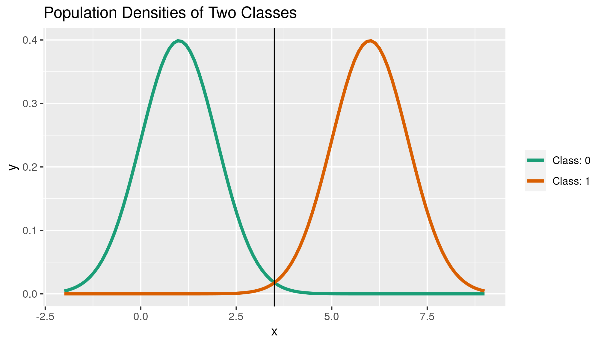
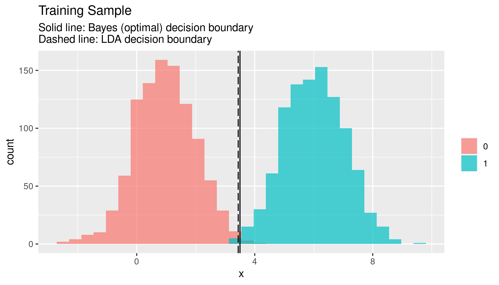

# Linear Discriminant Analysis

Linear discriminant analysis is way of estimating probability of class membership using [Bayes' theorem](https://en.wikipedia.org/wiki/Bayes%27_theorem){target="_blank"}.

We first do a simple univariate example with binary outcomes, then a multivariate case with three outcomes.

## Univariate LDA

This example walks through using linear discriminant analysis to classify observations in a two-class univariate setting with (idealized) generated data. 

### Theory

The LDA classifier uses estimates of mean and variance for each class as well as discriminant functions to determine the probability that an observation is of a particular class. The LDA classifier then assigns to each observation that class for which the estimated probability of membership is highest.

**LDA assumes equal variance between classes**. The theory discussion and example reflect this.

#### Bayes' Theorem

The general LDA model explored here and in [Elements of Statistical Learning](https://web.stanford.edu/~hastie/ElemStatLearn/printings/ESLII_print12_toc.pdf#%5B%7B%22num%22%3A195%2C%22gen%22%3A0%7D%2C%7B%22name%22%3A%22Fit%22%7D%5D){target="_blank"} is based on [Bayes' theorem for continuous variables](https://en.wikipedia.org/wiki/Bayes%27_theorem#For_continuous_random_variables){target="_blank"}. Since we have normal data, we use the normal probability density function (for each class, respectively) as our probability function. Taking Bayes' theorem

<center>
$$\Pr(Y = k|X = x) = \frac{\pi_k f_k(x)}{\sum^K_{j = 1} \pi_j f_j(x)}$$
</center>

where $k$ represents one class and $j$ all others, $\pi_k$ represents the prior probability of class $k$, and $f(\cdot)$ is some probability function, we substitute the normal PDF for $f(\cdot)$ and rewrite

<center>
$$\Pr(Y = k|X = x) = \frac{\pi_k \frac{1}{\sqrt{2 \color{red}{\pi} \sigma_k}} e^{ \left( \frac{-1}{2\sigma^2_k}(x - \mu_k)^2 \right)}}{\sum^K_{j = 1} \pi_j \frac{1}{\sqrt{2 \color{red}{\pi} \sigma_j}} e^{ \left( \frac{-1}{2\sigma^2_j}(x - \mu_j)^2 \right)}}$$
</center>

where $\color{red}{\pi}$ is literally the value pi (as used in the normal PDF), not a prior probability.

In this example, we only have two classes and we will set $\sigma_k = \sigma_l$.

A *Bayes decision boundary* is a boundary between classes along which the classifier determines the probability of class membership to be equal, i.e. $\Pr(Y = k|X = x) = \Pr(Y = l|X = x)$.

#### Discriminant Functions

So where does the "discriminant" in LDA come from? How does LDA divide between classes? In the two-class case like this example, we can use the log of the ratio of the probabilities to get our *discriminant functions* for each class. Taking the ratio of the probabilities...

<center>
$$\begin{align}
\frac{\Pr(Y = k|X = x)}{\Pr(Y = l|X = x)} &= \frac{\pi_k f_k(x)}{\sum^K_{j = 1} \pi_j f_j(x)} \frac{\sum^K_{j = 1} \pi_j f_j(x)}{\pi_l f_l(x)} \\ 
&= \frac{\pi_k f_k(x)}{\pi_l f_l(x)}
\end{align}$$
</center>

...and taking the log of the ratio...

<center>
$$\begin{align}
\log\frac{\Pr(Y = k|X = x)}{\Pr(Y = l|X = x)} &= \log \frac{\pi_k f_k(x)}{\pi_l f_l(x)} \\
&= \log{\frac{\pi_k}{\pi_l}} + \log{\frac{f_k(x)}{f_l(x)}}
\end{align}$$
</center>

...we can build a general formula for finding our discriminant functions. Plugging in the normal PDF for $f(\cdot)$ in this case allows for quite a lot of simplification.

<center>
$$\begin{align}
\log\frac{\Pr(Y = k|X = x)}{\Pr(Y = l|X = x)} &= \log{\frac{\pi_k}{\pi_l}} + \log \frac{\frac{1}{\sqrt{2 \color{red}{\pi} \sigma}} e^{ \left( \frac{-1}{2\sigma^2}(x - \mu_k)^2 \right)}}{\frac{1}{\sqrt{2 \color{red}{\pi} \sigma}} e^{ \left( \frac{-1}{2\sigma^2}(x - \mu_l)^2 \right)}} \\
&= \log{\frac{\pi_k}{\pi_l}} + \log \left( \frac{1}{\sqrt{2 \color{red}{\pi} \sigma}} \bigg/ \frac{1}{\sqrt{2 \color{red}{\pi} \sigma}} \right) + \log \frac{e^{ \left( \frac{-1}{2\sigma^2}(x - \mu_k)^2 \right)}}{e^{ \left( \frac{-1}{2\sigma^2}(x - \mu_l)^2 \right)}} \\
&= \log{\frac{\pi_k}{\pi_l}} + \log e^{ \left( \frac{-1}{2\sigma^2}(x - \mu_k)^2 \right)} - \log e^{ \left( \frac{-1}{2\sigma^2}(x - \mu_l)^2 \right)} \\
&= \log{\frac{\pi_k}{\pi_l}} - \frac{1}{2\sigma^2}(x - \mu_k)^2 + \frac{1}{2\sigma^2}(x - \mu_l)^2 \\
&= \log{\frac{\pi_k}{\pi_l}} + \frac{-x^2 + 2x \mu_k - \mu_k^2 + x^2 - 2x \mu_l + \mu_l^2}{2 \sigma^2} \\
&= \log{\frac{\pi_k}{\pi_l}} + x \frac{\mu_k - \mu_l}{\sigma^2} + \frac{\mu_l^2 - \mu_k^2}{2 \sigma^2}
\end{align}$$
</center>

Remember the Bayes decision boundary? The LDA decision boundary also exists where the probability of an observation being class $k$ is equal to its probability of being class $l$ in the two-class case, but using the sample data. If we think of our log-ratio in this way (in which case the ratio is 1 and so the log of the ratio is 0) and evaluate on the boundary then we can easily use the above expression to find our discriminant functions.

<center>
$$\Pr(Y = k|X = x) = \Pr(Y = l|X = x) \rightarrow \frac{\Pr(Y = k|X = x)}{\Pr(Y = l|X = x)} = 1$$
$$\begin{align}
\log \left( 1 \right) &= \log{\frac{\pi_k}{\pi_l}} + x \frac{\mu_k - \mu_l}{\sigma^2} + \frac{\mu_l^2 - \mu_k^2}{2 \sigma^2} \\
0 &= \log{\pi_k} - \log{\pi_l} + \frac{x \mu_k}{\sigma^2} - \frac{x \mu_l}{\sigma^2} + \frac{\mu_l^2}{2 \sigma^2} - \frac{\mu_k^2}{2 \sigma^2} \\
\underbrace{\log \pi_l + \frac{x \mu_l}{\sigma^2} - \frac{\mu_l^2}{2 \sigma^2}}_{\delta_l(x)} &= \underbrace{\log \pi_k + \frac{x \mu_k}{\sigma^2} - \frac{\mu_k^2}{2 \sigma^2}}_{\delta_k (x)}
\end{align}$$
</center>

$\delta_k(x)$ and $\delta_l(x)$ are our discriminant functions which we use to classify observations. We use a simple decision rule for classification: if for observation $x_i$ the $k$ discriminant function evaluates greater than the $l$ discriminant function then we assign $x_i$ to class $k$.

### Setup

This example uses the [`tidyverse`](https://cran.r-project.org/web/packages/tidyverse/index.html){target="_blank"} and [`patchwork`](https://patchwork.data-imaginist.com/){target="_blank"} packages.


```r
library(tidyverse)
library(patchwork)
```

### Data Generation

We'll generate train and test data for two classes (coded 0/1): 1,000 normally-distributed observations for each class with differing means for each class but equal variances. 


```r
means <- sample.int(6, 2, replace = FALSE)

population0_mean <- min(means)
population0_sd <- 1

population1_mean <- max(means)
population1_sd <- 1

c0_train <- tibble(y = 0,
                   x = rnorm(1000, 
                             mean = population0_mean, 
                             sd = population0_sd))
c1_train <- tibble(y = 1,
                   x = rnorm(1000,
                             mean = population1_mean, 
                             sd = population1_sd))

c0_test <- tibble(y = 0,
                  x = rnorm(1000, 
                             mean = population0_mean, 
                             sd = population0_sd))
c1_test <- tibble(y = 1,
                  x = rnorm(1000, 
                             mean = population1_mean, 
                             sd = population1_sd))

train_sample_df <- bind_rows(c0_train, c1_train)
test_sample_df <- bind_rows(c0_test, c1_test)
```

We can easily visualize the distributions of our class-wise populations:


```r
population_density <- ggplot(data.frame(x = c(population0_mean - 3 * population0_sd,
                                              population1_mean + 3 * population1_sd)), 
                             aes(x)) + 
  stat_function(fun = dnorm, 
                aes(color = "Class: 0"), size = 1.25,
                args = list(mean = population0_mean, sd = population0_sd)) +
  stat_function(fun = dnorm, 
                aes(color = "Class: 1"), size = 1.25,
                args = list(mean = population1_mean, sd = population1_sd)) +
  scale_color_brewer(palette = "Dark2") +
  labs(title = "Population Densities of Two Classes") +
  theme(legend.title = element_blank())

population_density
```


Let's also quickly visualize the train and test data:


```r
train_sample_histogram <- ggplot(train_sample_df) +
  geom_histogram(aes(x = x, fill = as.factor(y)), 
                 alpha = .7,
                 position = "identity") +
  scale_color_brewer(palette = "Dark2",
                     labels = c("Class: 0", "Class: 1")) +
  labs(title = "Training Sample") +
  theme(legend.title = element_blank())

test_sample_histogram <- ggplot(test_sample_df) +
  geom_histogram(aes(x = x, fill = as.factor(y)), 
                 alpha = .7,
                 position = "identity") +
  scale_color_brewer(palette = "Dark2",
                     labels = c("Class: 0", "Class: 1")) +
  labs(title = "Test Sample") +
  theme(legend.title = element_blank())

train_sample_histogram + test_sample_histogram
```


### Implementation

#### Bayes Decision Boundary

We'll use the [Bayes classifier](https://en.wikipedia.org/wiki/Bayes_classifier){target="_blank"} as a comparison for our LDA. As covered in the [theory section](Theory) the Bayes classifier simply assigns an observation to the class for which an observation has the highest prior probability of belonging. The Bayes decision boundary is the boundary for which the probability of an observation being classified by the Bayes classifier is equal among classes; in this case, we will only have one boundary because we only have two classes.

We'll compute the optimal Bayes decision boundary from the *population* data to compare our LDA against. In this case, since we only have two classes and one independent variable/predictor, it's easy:


```r
bayes_decision <- (population0_mean ^ 2 - population1_mean ^ 2) /
  (2 * (population0_mean - population1_mean))
```

We can easily add this optimal boundary to our population density plot and histogram. Unsurprisingly, the decision boundary lies where the two [PDF](https://en.wikipedia.org/wiki/Probability_density_function){target="_blank"}s meet:


```r
population_density + geom_vline(xintercept = bayes_decision,
                                color = "black")
```




```r
train_sample_histogram + geom_vline(xintercept = bayes_decision,
                                color = "black")
```


#### LDA Decision Boundary

For our estimates of the mean and variance we use the empirical (i.e., data/sample-derived) class-specific means and standard deviations. Even though the class variances are equivalent in this case we will treat them separately for thoroughness. 

We also need to calculate the empirical prior probability that an observation belongs to each class. In this case, both will be 0.5 since we have equal samples but we will again calculate these separately for thoroughness.


```r
class_0_mean <- mean(train_sample_df$x[train_sample_df$y == 0])
class_0_var <- var(train_sample_df$x[train_sample_df$y == 0])

class_1_mean <- mean(train_sample_df$x[train_sample_df$y == 1])
class_1_var <- var(train_sample_df$x[train_sample_df$y == 1])

class_0_prior <- length(train_sample_df$x[train_sample_df$y == 0]) /
  length(train_sample_df$x)

class_1_prior <- length(train_sample_df$x[train_sample_df$y == 1]) /
  length(train_sample_df$x)
```

Building our discriminant functions as specified in the previous section is simple. We'll write these as functions.


```r
d0 <- function(x){
  x * (class_0_mean / class_0_var) - (class_0_mean ^ 2 / (2 * class_0_var ^ 2)) +
    log(class_0_prior)
}

d1 <- function(x){
  x * (class_1_mean / class_1_var) - (class_1_mean ^ 2 / (2 * class_1_var ^ 2)) +
    log(class_1_prior)
}
```

Then we can build our simple decision rule function, assigning an observation to class $k$ if $\delta_k(x) > \delta_l(x)$ and vice versa:


```r
LDA <- function(x){
  
  score_0 <- d0(x)
  score_1 <- d1(x)
  
  ifelse(score_0 > score_1, 0, 1)

}
```

Then we can [`apply`](https://www.rdocumentation.org/packages/base/versions/3.6.2/topics/apply){target="_blank"} our LDA function over our training data to classify the observations:


```r
train_sample_df$predicted_y <- apply(train_sample_df[,2], MARGIN = 1, LDA)
```

Because our discriminant functions are linear in $x$, we can also solve for the value of $x$ that acts as our LDA boundary:


```r
LDA_decision <- (class_0_mean ^ 2 / (2 * class_0_var) -
                   class_1_mean ^ 2 / (2 * class_0_var) +
                   log(class_1_prior) - log(class_0_prior)) /
                (class_0_mean / class_0_var - class_1_mean / class_1_var)
```

And we can easily visualize both our (population-based) Bayes decision boundary and our (sample-based) LDA decision boundary:


```r
train_sample_histogram + 
  geom_vline(xintercept = bayes_decision,
                                   color = "black") +
  geom_vline(xintercept = LDA_decision,
             color = "black",
             linetype = "longdash") +
  labs(subtitle = "Solid line: Bayes (optimal) decision boundary\nDashed line: LDA decision boundary")
```



### Testing

Using the decision boundary from our LDA model applied to the training data, we can simply and easily classify the test data observations:


```r
test_sample_df$predicted_y <- if_else(test_sample_df$x < LDA_decision,
                                             0, 1)
```

What's LDA's misclassification rate for the test data in this case?


```r
LDA_misclass_rate <- nrow(test_sample_df[test_sample_df$y != 
                                           test_sample_df$predicted_y,]) /
                     nrow(test_sample_df)

LDA_misclass_rate * 100
```

```
## [1] 1.25
```

It's certainly not perfect! But how imperfect is it? Since we're using Bayes' classifier on the population data as our standard, we can apply its decision rule to the test data and calculate its misclassification rate.


```r
test_sample_df$bayes_predicted_y <- if_else(test_sample_df$x < bayes_decision,
                                       0, 1)

bayes_misclass_rate <- nrow(test_sample_df[test_sample_df$y != 
                                             test_sample_df$bayes_predicted_y,]) /
                       nrow(test_sample_df)

bayes_misclass_rate * 100
```

```
## [1] 0.75
```

Of course, it is possible for LDA to "outperform" the optimal Bayes classifier depending on the train and test samples, but the Bayes classifier here in a sense represents the "true" optimal classifier since it is coming from population data.

## Multivariate LDA

This example walks through using linear discriminant analysis to classify observations in a three-class multivariate setting with (idealized) generated data.

### Theory

This section builds on the [theory behind univariate LDA example](univariate-lda.html#theory){target="_blank"}. The theory in the multivariate case is essentially the same, but we will cover it here for thoroughness.

Similar to the univariate example, in the multivariate case **LDA assumes identical variance-covariance matrices between classes**. The theory discussion and example reflect this.

#### Bayes' Theorem

Like in the univariate case, take Bayes' theorem,

<center>
$$\Pr(Y = k|X = x) = \frac{\pi_k f_k(x)}{\sum^K_{j = 1} \pi_j f_j(x)}$$
</center>

where 

- $k$ is one class and $j$ all others,
- $\pi_k$ represents the prior probability of class $k$, 
- $p$ is the number of variables/predictors, and
- $f(\cdot)$ is some probability function. 

In this case we use the [multivariate normal PDF](https://en.wikipedia.org/wiki/Multivariate_normal_distribution){target="_blank"}

<center>
$$\frac{1}{(2\color{red}{\pi})^{\frac{p}{2}} \det(\Sigma)^\frac{1}{2}} e^{\frac{-1}{2} (x - \mu_k)^T \Sigma^{-1} (x - \mu_k)}$$
</center>

where, in this idealized example, $\Sigma_k, \Sigma_l, \ldots, \Sigma_K = \Sigma$ since we are assuming (and in fact generating data from a distribution in which) all classes have the same covariance matrix. As noted in the univariate example, $\color{red}{\pi}$ in the PDF is the literal value pi, not a prior probability.

Whereas in the univariate case we only had two outcomes/classes, in this example we have three. Instead of pairwise solving for two discriminant functions we need to pairwise solve for three. The process is of course the same for each pair, so we will generically work through solving for the discriminant functions for a single pair of classes.

Just as in the univariate case, in order to arrive at our discriminant functions we take the log of the ratio of conditional probabilities and the summation terms in the ratio cancel, leaving us with

<center>
$$\begin{align}
\log\frac{\Pr(Y = k|X = x)}{\Pr(Y = l|X = x)} &= \log \frac{\pi_k f_k(x)}{\pi_l f_l(x)} \\
&= \log{\frac{\pi_k}{\pi_l}} + \log{\frac{f_k(x)}{f_l(x)}}
\end{align}$$
</center>

Plugging in the multivariate normal PDF for $f(\cdot)$, like in the univariate case, allows for a lot of simplification but with some twists:

<center>
$$\small \begin{align}
\log\frac{\Pr(Y = k|X = x)}{\Pr(Y = l|X = x)} &= \log{\frac{\pi_k}{\pi_l}} + \log \frac{\frac{1}{{(2\color{red}{\pi}})^{\frac{p}{2}} \det(\Sigma)^\frac{1}{2}} e^{\frac{-1}{2} (x - \mu_k)^T \Sigma^{-1} (x - \mu_k)}}{\frac{1}{{(2\color{red}{\pi}})^{\frac{p}{2}} \det(\Sigma)^\frac{1}{2}} e^{\frac{-1}{2} (x - \mu_l)^T \Sigma^{-1} (x - \mu_l)}} \\
&= \log{\frac{\pi_k}{\pi_l}} + \log \left( \frac{1}{{(2\color{red}{\pi}})^{\frac{p}{2}} \det(\Sigma)^\frac{1}{2}} \bigg/ \frac{1}{{(2\color{red}{\pi}})^{\frac{p}{2}} \det(\Sigma)^\frac{1}{2}}  \right) + \log{\frac{e^{\frac{-1}{2} (x - \mu_k)^T \Sigma^{-1} (x - \mu_k)}}{e^{\frac{-1}{2} (x - \mu_l)^T \Sigma^{-1} (x - \mu_l)}}} \\
&= \log{\frac{\pi_k}{\pi_l}} - \frac{1}{2} (x - \mu_k)^T \Sigma^{-1} (x - \mu_k) + \frac{1}{2} (x - \mu_l)^T \Sigma^{-1} (x - \mu_l) \\
\end{align}$$
</center>

Because $\Sigma$ represents the covariance matrix for all classes, a convenient cancellation occurs after we expand the right two terms in the expression above:

<center>
$$\begin{align}
\log\frac{\Pr(Y = k|X = x)}{\Pr(Y = l|X = x)} &= \log{\frac{\pi_k}{\pi_l}} - \frac{1}{2} (x - \mu_k)^T \Sigma^{-1} (x - \mu_k) + \frac{1}{2} (x - \mu_l)^T \Sigma^{-1} (x - \mu_l) \\
&= \log{\frac{\pi_k}{\pi_l}} \color{red}{- \frac{1}{2}x^T \Sigma^{-1}x} + \frac{1}{2}x^T \Sigma^{-1} \mu_k + \frac{1}{2}\mu_k^T \Sigma^{-1} x - \frac{1}{2} \mu_k^T \Sigma^{-1} \mu_k \\ &\qquad \qquad \color{red}{+ \frac{1}{2}x^T \Sigma^{-1}x} - \frac{1}{2}x^T \Sigma^{-1} \mu_l - \frac{1}{2}\mu_l^T \Sigma^{-1} x + \frac{1}{2} \mu_l^T \Sigma^{-1} \mu_l \\
&= \log{\frac{\pi_k}{\pi_l}} \color{purple}{+ \frac{1}{2}x^T \Sigma^{-1} \mu_k + \frac{1}{2}\mu_k^T \Sigma^{-1} x} \color{green}{- \frac{1}{2} \mu_k^T \Sigma^{-1} \mu_k} \\ &\qquad ~~~~~~~ \color{purple}{- \frac{1}{2}x^T \Sigma^{-1} \mu_l - \frac{1}{2}\mu_l^T \Sigma^{-1} x} \color{green}{+ \frac{1}{2} \mu_l^T \Sigma^{-1} \mu_l} \\
\end{align}$$
</center>

This is where the fun starts. Because $\Sigma$ is symmetric (and so $\Sigma^{-1}$ is symmetric) $a^T \Sigma^{-1} b = b^T \Sigma^{-1} a$. So the <span style="color:purple">purple</span> terms can be rewritten and consolidated:

<center>
$$\begin{align}
\log\frac{\Pr(Y = k|X = x)}{\Pr(Y = l|X = x)} &= \log{\frac{\pi_k}{\pi_l}} \color{purple}{+ x^T \Sigma^{-1} \mu_k} \color{purple}{- x^T \Sigma^{-1} \mu_l} \color{green}{- \frac{1}{2} \mu_k^T \Sigma^{-1} \mu_k} \color{green}{+ \frac{1}{2} \mu_l^T \Sigma^{-1} \mu_l} \\
&= \log{\frac{\pi_k}{\pi_l}} \color{purple}{+ x^T \Sigma^{-1} (\mu_k - \mu_l)} \color{green}{- \frac{1}{2} \mu_k^T \Sigma^{-1} \mu_k} \color{green}{+ \frac{1}{2} \mu_l^T \Sigma^{-1} \mu_l} \\
\end{align}$$
</center>

The <span style="color:green">green</span> terms can't be easily simplified unless we creatively add zero to the equation. Using the above property that $a^T \Sigma^{-1} b = b^T \Sigma^{-1} a$ we can do exactly that. Let's add $0 = \frac{1}{2} \mu_k^T \Sigma^{-1} \mu_l - \frac{1}{2} \mu_l^T \Sigma^{-1} \mu_k$ and factor and consolidate:

<center>
$$\small \begin{align}
\log\frac{\Pr(Y = k|X = x)}{\Pr(Y = l|X = x)} &= \log{\frac{\pi_k}{\pi_l}} \color{purple}{+ x^T \Sigma^{-1} (\mu_k - \mu_l)} \color{green}{- \frac{1}{2} \mu_k^T \Sigma^{-1} \mu_k} \color{green}{+ \frac{1}{2} \mu_l^T \Sigma^{-1} \mu_l + \frac{1}{2} \mu_k^T \Sigma^{-1} \mu_l - \frac{1}{2} \mu_l^T \Sigma^{-1} \mu_k} \\
&= \log{\frac{\pi_k}{\pi_l}} \color{purple}{+ x^T \Sigma^{-1} (\mu_k - \mu_l)} \color{green}{- \frac{1}{2} \mu_k^T \Sigma^{-1} (\mu_k - \mu_l) - \frac{1}{2} \mu_l^T \Sigma^{-1} (\mu_k - \mu_l)} \\
&= \log{\frac{\pi_k}{\pi_l}} \color{purple}{+ x^T \Sigma^{-1} (\mu_k - \mu_l)} \color{green}{- \frac{1}{2} (\mu_k + \mu_l)^T \Sigma^{-1} (\mu_k - \mu_l)} \\
\end{align}$$
</center>

#### Discriminant Functions

The above derivation gets us to the nice, neat expression in [Elements of Statistical Learning](https://web.stanford.edu/~hastie/ElemStatLearn/printings/ESLII_print12_toc.pdf#%5B%7B%22num%22%3A195%2C%22gen%22%3A0%7D%2C%7B%22name%22%3A%22Fit%22%7D%5D){target="_blank"}, but for arriving at our discriminant functions it's easier to stay with the fully-expanded-without-consolidating expression. From this point on we will work from the following expression we intermediately arrived at above:

<center>
$$\log\frac{\Pr(Y = k|X = x)}{\Pr(Y = l|X = x)} = \log{\frac{\pi_k}{\pi_l}} + x^T \Sigma^{-1} \mu_k - x^T \Sigma^{-1} \mu_l - \frac{1}{2} \mu_k^T \Sigma^{-1} \mu_k + \frac{1}{2} \mu_l^T \Sigma^{-1} \mu_l$$
</center>

Just like in the univariate case, all we need to do to get the discriminant functions is evaluate this ratio on the pairwise decision boundary where our probability ratio is 1 and so the log of the ratio is 0. Doing this, we can simply rearrange the expression to get our discriminant functions for classes $k$ and $l$

<center>
$$\small \begin{align}
0 &= \log{\pi_k} - \log{\pi_l} + x^T \Sigma^{-1} \mu_k - x^T \Sigma^{-1} \mu_l - \frac{1}{2} \mu_k^T \Sigma^{-1} \mu_k + \frac{1}{2} \mu_l^T \Sigma^{-1} \mu_l \\
\underbrace{\log{\pi_l} + x^T \Sigma^{-1} \mu_l - \frac{1}{2} \mu_l^T \Sigma^{-1} \mu_l}_{\delta_l (x)} &= \underbrace{\log{\pi_k} + x^T \Sigma^{-1} \mu_k - \frac{1}{2} \mu_k^T \Sigma^{-1} \mu_k}_{\delta_k (x)} \\
\end{align}$$
</center>

Again, just like in the univariate case, we evaluate the discriminant functions for each class for some observation's vector of values for X1 and X2, then assign the class to that observation for which the discriminant function evaluates largest.

#### Estimating the Variance-Covariance Matrix

In reality, we typically don't know the covariance matrix, prior probabilities, and class-wise population means for our variables. Instead, we need to estimate them from the sample data. Estimating the class-wise population means and prior probabilities is easy: we can simply use the empirical means and proportions as estimates, respectively.

Estimating the common covariance matrix is less straightforward. We estimate this matrix by creating a weighted average of covariance matrices within each class with a [Bessel-like correction](https://en.wikipedia.org/wiki/Bessel%27s_correction){target="_blank"}. This is a lot like [pooled variance](https://en.wikipedia.org/wiki/Pooled_variance){target="_blank"}.

<center>
$$\hat{\Sigma} = \frac{\sum_{k = 1}^K \sum_{i = 1; y = k}^{n_k} (x_i - \hat{\mu}_k)(x_i - \hat{\mu}_k)^T}{n - K}$$
</center>

$K$ here is the total number of classes.

Because we are still assuming that all classes have the same covariance matrix (in this case, the estimated matrix $\hat{\Sigma}$) none of the derivations in the Bayes classifier theory section are different: we are simply substituting the "true" means and covariance matrix in the Bayes classifier with our estimates since we usually cannot know the "true" parameters.

### Setup

This example uses the [`tidyverse`](https://cran.r-project.org/web/packages/tidyverse/index.html){target="_blank"} and [`MASS`](https://cran.r-project.org/web/packages/MASS/index.html){target="_blank"} packages.


```r
library(tidyverse)
library(MASS)
```

### Data Generation

We'll generate data with three possible outcome classes (coded as 0, 1, and 2) with two independent variables/predictors.

We'll use `MASS`'s [`mvnorm`](https://www.rdocumentation.org/packages/rockchalk/versions/1.8.144/topics/mvrnorm){target="_blank"} function to sample from a multivariate normal distribution. Throughout this example we'll refer to the first variable as X1 and the second variable as X2. For each class we'll construct a vector of means for X1 and X2 with randomly sampled integers between 1 and 10:


```r
X1_means <- sample.int(10, 3, replace = FALSE)
X2_means <- sample.int(10, 3, replace = FALSE)

pop_mean_c0_X1 <- X1_means[1]
pop_mean_c1_X1 <- X1_means[2]
pop_mean_c2_X1 <- X1_means[3]

pop_mean_c0_X2 <- X2_means[1]
pop_mean_c1_X2 <- X2_means[2]
pop_mean_c2_X2 <- X2_means[3]

mu_c0 <- c(pop_mean_c0_X1, pop_mean_c0_X2)
mu_c1 <- c(pop_mean_c1_X1, pop_mean_c1_X2)
mu_c2 <- c(pop_mean_c2_X1, pop_mean_c2_X2)
```

Remember that in the univariate case LDA assumes equal variance for each class so in the multivariate case **LDA assumes equal covariance for each class**, meaning that the population covariance matrices for each class are identical (they also need to be [positive semi-definite](https://en.wikipedia.org/wiki/Definite_matrix){target="_blank"}). For our data to be sampled from distributions with this idealized property, we'll construct a single covariance matrix (which we'll call `pop_sigma`) to use when sampling our data:


```r
pop_corr <- runif(1, 0, 1)
pop_var <- runif(1, 0, 10)
pop_sigma <- matrix(c(pop_var, pop_corr,
                      pop_corr, pop_var), 2, 2)
```

Now that we have our variable- and class-specific means and a common covariance matrix we can use `mvnorm` to generate our sample data. We'll create equally-sized train and test sets with 300 observations in each of our three classes and bind our X1 and X2 samples together with our outcome set into a data frame. Using a loop with the [`get`](https://www.rdocumentation.org/packages/base/versions/3.6.2/topics/get){target="_blank"} and  [`assign`](https://www.rdocumentation.org/packages/base/versions/3.6.2/topics/assign){target="_blank"} functions, we can variably refer to our class-level means as well as variably generate our class sample data sets.


```r
n <- 300

for (i in 0:2) {
  
  class <- paste("c", i, sep = "")
  
  mu = paste("mu", class, sep = "_")
  
  temp_train_data <- mvrnorm(n = n,
                             mu = get(mu),
                             Sigma = pop_sigma)
  
  temp_test_data <- mvrnorm(n = n,
                            mu = get(mu),
                            Sigma = pop_sigma)

  assign(paste(class, "train", sep = "_"), temp_train_data)
  assign(paste(class, "test", sep = "_"), temp_test_data)
  
}

train_sample_df <- bind_rows(
  tibble(y = 0,
         X1 = c0_train[,1],
         X2 = c0_train[,2]),
  tibble(y = 1,
         X1 = c1_train[,1],
         X2 = c1_train[,2]),
  tibble(y = 2,
         X1 = c2_train[,1],
         X2 = c2_train[,2])
)

test_sample_df <- bind_rows(
  tibble(y = 0,
         X1 = c0_test[,1],
         X2 = c0_test[,2]),
  tibble(y = 1,
         X1 = c1_test[,1],
         X2 = c1_test[,2]),
  tibble(y = 2,
         X1 = c2_test[,1],
         X2 = c2_test[,2])
)
```

What do our data look like? We can easily create scatterplots:


```r
train_sample_scatter <- ggplot(train_sample_df) + 
  geom_point(aes(x = X1, y = X2, color = as.factor(y))) +
  scale_color_brewer(palette = "Dark2", name = "class") +
  labs(title = "Bivariate Training Sample of Three Classes: Scatterplot")

test_sample_scatter <- ggplot(test_sample_df) + 
  geom_point(aes(x = X1, y = X2, color = as.factor(y))) +
  scale_color_brewer(palette = "Dark2", name = "class") +
  labs(title = "Bivariate Test Sample of Three Classes: Scatterplot")

train_sample_scatter
```


### Implementation

#### The Bayes Classifier and Decision Boundaries

Like with the [univariate LDA example](univariate_LDA.html){target="_blank} we will compare performance against the Bayes classifier. This time, because we have more than one independent variable/predictor, building the classifier and displaying the decision boundaries won't be as straightforward as in the univariate LDA case (though the fundamental concept is the same).

Also like in the univariate example, we will use a discriminant function to determine which class to assign to a given observation. The discriminant functions are exactly the same and are derived in the same way, except that since we have more than one independent variable we will use a vector of variables and instead of a scalar variance ($\sigma$) we will use the common covariance matrix we constructed above ($\Sigma$).

We can easily build our class-wise discriminant functions. Since we also know the true parameters of the distributions we are sampling from we can create the *optimal* decision boundaries.

First, we'll construct vectors of our population means by class as well as the class-wise prior probabilities. In this example we know that the class-wise prior probabilities are equal, but we'll calculate them each separately for thoroughness.


```r
pop_c0_mean_vec <- c(pop_mean_c0_X1, pop_mean_c0_X2)
pop_c1_mean_vec <- c(pop_mean_c1_X1, pop_mean_c1_X2)
pop_c2_mean_vec <- c(pop_mean_c2_X1, pop_mean_c2_X2)

pop_c0_prior <- n / (n * 3)
pop_c1_prior <- n / (n * 3)
pop_c2_prior <- n / (n * 3)
```

Then we'll build our three discriminant functions and [`apply`](https://www.rdocumentation.org/packages/base/versions/3.6.2/topics/apply){target="_blank"} them inside the decision rule for classification described above.


```r
d0_bayes <- function(x_vec){
  t(x_vec) %*% solve(pop_sigma) %*% pop_c0_mean_vec -
    .5 * t(pop_c0_mean_vec) %*% solve(pop_sigma) %*% pop_c0_mean_vec +
    log(pop_c0_prior)
}

d1_bayes <- function(x_vec){
  t(x_vec) %*% solve(pop_sigma) %*% pop_c1_mean_vec -
    .5 * t(pop_c1_mean_vec) %*% solve(pop_sigma) %*% pop_c1_mean_vec +
    log(pop_c1_prior)
}

d2_bayes <- function(x_vec){
  t(x_vec) %*% solve(pop_sigma) %*% pop_c2_mean_vec -
    .5 * t(pop_c2_mean_vec) %*% solve(pop_sigma) %*% pop_c2_mean_vec +
    log(pop_c2_prior)
}

bayes_classifier <- function(x_vec){
  score_c0 <- d0_bayes(x_vec)
  score_c1 <- d1_bayes(x_vec)
  score_c2 <- d2_bayes(x_vec)
  
  if (score_c0 > score_c1 & score_c0 > score_c2) {
    0
  } else if (score_c1 > score_c0 & score_c1 > score_c2) {
    1
  } else {
    2
  }
}

train_sample_df$bayes_predicted_y <- apply(train_sample_df[, c("X1", "X2")], 
                                           1, bayes_classifier)
```

Can we plot the decision boundaries? Absolutely, but it's a little more involved than in the univariate case. How *do* we draw these boundary lines?

One obvious thing must be true: the decision boundary between two classes must pass through the midpoint between the centers of the two classes. 

What determines the direction of the line crossing through this point? The boundary line is orthogonal^[See [this excellent CV answer](https://stats.stackexchange.com/questions/92157/compute-and-graph-the-lda-decision-boundary/103552#103552){target="_blank"} for explanations why.] to $\Sigma^{-1} (\mu_k - \mu_l)$. To get a vector orthogonal to $\Sigma^{-1} (\mu_k - \mu_l)$ we can use `MASS`'s [`Null`](https://www.rdocumentation.org/packages/MASS/versions/7.3-54/topics/Null){target="_blank"} function.


```r
# Calculate midpoints between class-level population mean-vectors
pop_c0_c1_midpoint <- (pop_c0_mean_vec + pop_c1_mean_vec) / 2
pop_c0_c2_midpoint <- (pop_c0_mean_vec + pop_c2_mean_vec) / 2
pop_c1_c2_midpoint <- (pop_c1_mean_vec + pop_c2_mean_vec) / 2

# Generate orthogonal vectors
pop_c0_c1_ortho <- Null(solve(pop_sigma) %*% 
                      (pop_c0_mean_vec - pop_c1_mean_vec))
pop_c0_c2_ortho <- Null(solve(pop_sigma) %*% 
                      (pop_c0_mean_vec - pop_c2_mean_vec))
pop_c1_c2_ortho <- Null(solve(pop_sigma) %*% 
                      (pop_c1_mean_vec - pop_c2_mean_vec))
```

Then we can use these midpoints and orthogonal vectors to overlay the decision boundaries over the scatterplot we created above:


```r
train_sample_scatter <- train_sample_scatter +
  geom_segment(aes(x = pop_c0_c1_midpoint[1] - 5 * pop_c0_c1_ortho[1],
                   xend = pop_c0_c1_midpoint[1] + 5 * pop_c0_c1_ortho[1],
                   y = pop_c0_c1_midpoint[2] - 5 * pop_c0_c1_ortho[2],
                   yend = pop_c0_c1_midpoint[2] + 5 * pop_c0_c1_ortho[2]),
               linetype = "solid") +
  geom_segment(aes(x = pop_c0_c2_midpoint[1] - 5 * pop_c0_c2_ortho[1],
                   xend = pop_c0_c2_midpoint[1] + 5 * pop_c0_c2_ortho[1],
                   y = pop_c0_c2_midpoint[2] - 5 * pop_c0_c2_ortho[2],
                   yend = pop_c0_c2_midpoint[2] + 5 * pop_c0_c2_ortho[2]),
               linetype = "solid") +
  geom_segment(aes(x = pop_c1_c2_midpoint[1] - 5 * pop_c1_c2_ortho[1],
                   xend = pop_c1_c2_midpoint[1] + 5 * pop_c1_c2_ortho[1],
                   y = pop_c1_c2_midpoint[2] - 5 * pop_c1_c2_ortho[2],
                   yend = pop_c1_c2_midpoint[2] + 5 * pop_c1_c2_ortho[2]),
               linetype = "solid")

train_sample_scatter
```


Obviously the segments represented above are just that: segments. The true lines extend infinitely in both directions.

#### The LDA Classifier and Decision Boundaries

Like before, first we'll construct vectors of our *sample* means by class as well as the class-wise prior probabilities. Also like before, in this example we know that the class-wise prior probabilities are equal, but we'll calculate estimates of each separately for thoroughness. Depending on your sample, your class samples obviously may not be same size.


```r
sample_c0_mean_vec <- c(mean(train_sample_df$X1[train_sample_df$y == 0]), 
                        mean(train_sample_df$X2[train_sample_df$y == 0]))
sample_c1_mean_vec <- c(mean(train_sample_df$X1[train_sample_df$y == 1]), 
                        mean(train_sample_df$X2[train_sample_df$y == 1]))
sample_c2_mean_vec <- c(mean(train_sample_df$X1[train_sample_df$y == 2]), 
                        mean(train_sample_df$X2[train_sample_df$y == 2]))

sample_c0_prior <- nrow(train_sample_df[train_sample_df$y == 0,]) /
  nrow(train_sample_df)
sample_c1_prior <- nrow(train_sample_df[train_sample_df$y == 1,]) /
  nrow(train_sample_df)
sample_c2_prior <- nrow(train_sample_df[train_sample_df$y == 2,]) /
  nrow(train_sample_df)
```

To build $\hat{\Sigma}$ we will first de-mean the X1 and X2 vectors class-wise. We will do this explicitly and add^[See [`mutate`](https://dplyr.tidyverse.org/reference/mutate.html){target="_blank"}.] these de-meaned versions of the X1 and X2 variables to the data tibble rather than de-mean the variables within a loop for conceptual simplicity.


```r
sample_mean_c0_X1 <- mean(train_sample_df$X1[train_sample_df$y == 0])
sample_mean_c0_X2 <- mean(train_sample_df$X2[train_sample_df$y == 0])
sample_mean_c1_X1 <- mean(train_sample_df$X1[train_sample_df$y == 1])
sample_mean_c1_X2 <- mean(train_sample_df$X2[train_sample_df$y == 1])
sample_mean_c2_X1 <- mean(train_sample_df$X1[train_sample_df$y == 2])
sample_mean_c2_X2 <- mean(train_sample_df$X2[train_sample_df$y == 2])

train_sample_df <- train_sample_df %>%
  mutate(centered_X1_sample = if_else(y == 0, X1 - sample_mean_c0_X1,
                                   if_else(y == 1, X1 - sample_mean_c1_X1,
                                           X1 - sample_mean_c2_X1)),
         centered_X2_sample = if_else(y == 0, X2 - sample_mean_c0_X2,
                                   if_else(y == 1, X2 - sample_mean_c1_X2,
                                           X2 - sample_mean_c2_X2)))
```

Then we can build our estimated covariance matrix with a simple for loop and make the correction afterward:


```r
# Zero-matrix of correct dimensions to build over
train_sigma_LDA <- matrix(c(0, 0, 
                            0, 0), 2, 2)

for (i in 1:nrow(train_sample_df)) {
  
  temp_cov <- c(train_sample_df$centered_X1_sample[i], train_sample_df$centered_X2_sample[i])
  
  train_sigma_LDA <- train_sigma_LDA + temp_cov %*% t(temp_cov)
  
}

# Correct the covariance matrix
train_sigma_LDA <- train_sigma_LDA / (n * 3 - 3)
```

How close is our $\hat{\Sigma}$ to $\Sigma$?


```r
pop_sigma
```

```
##           [,1]      [,2]
## [1,] 0.9881612 0.4093630
## [2,] 0.4093630 0.9881612
```

```r
train_sigma_LDA
```

```
##          [,1]     [,2]
## [1,] 1.035851 0.454914
## [2,] 0.454914 1.098046
```

Then, exactly like we did with the Bayes classifier, we build the LDA classifier by creating our discriminant functions and `apply` them via a decision rule function to our training sample:


```r
d0_LDA <- function(x_vec){
  t(x_vec) %*% solve(train_sigma_LDA) %*% sample_c0_mean_vec -
    .5 * t(sample_c0_mean_vec) %*% solve(train_sigma_LDA) %*% 
    sample_c0_mean_vec + log(sample_c0_prior)
}

d1_LDA <- function(x_vec){
  t(x_vec) %*% solve(train_sigma_LDA) %*% sample_c1_mean_vec -
    .5 * t(sample_c1_mean_vec) %*% solve(train_sigma_LDA) %*% 
    sample_c1_mean_vec + log(sample_c1_prior)
}

d2_LDA <- function(x_vec){
  t(x_vec) %*% solve(train_sigma_LDA) %*% sample_c2_mean_vec -
    .5 * t(sample_c2_mean_vec) %*% solve(train_sigma_LDA) %*% 
    sample_c2_mean_vec + log(sample_c2_prior)
}

LDA_classifier <- function(x_vec){
  score_c0 <- d0_LDA(x_vec)
  score_c1 <- d1_LDA(x_vec)
  score_c2 <- d2_LDA(x_vec)
  
  if (score_c0 > score_c1 & score_c0 > score_c2) {
    0
  } else if (score_c1 > score_c0 & score_c1 > score_c2) {
    1
  } else {
    2
  }
}

train_sample_df$LDA_predicted_y <- apply(train_sample_df[, c("X1", "X2")], 
                                           1, LDA_classifier)
```

We can then overlay these lines on our existing scatterplot just like we did with the Bayes decision boundaries. Again, we will calculate pairwise class midpoints with the *sample* data and use `Null` to generate vectors orthogonal to $\hat{\Sigma} (\hat{\mu}_k - \hat{\mu}_l)$. This time we'll plot the LDA decision boundaries as dashed lines.


```r
# Calculate midpoints between class-level sample mean-vectors
sample_c0_c1_midpoint <- (sample_c0_mean_vec + sample_c1_mean_vec) / 2
sample_c0_c2_midpoint <- (sample_c0_mean_vec + sample_c2_mean_vec) / 2
sample_c1_c2_midpoint <- (sample_c1_mean_vec + sample_c2_mean_vec) / 2

# Generate the sample orthogonal vectors for plotting
sample_c0_c1_ortho <- Null(solve(train_sigma_LDA) %*% 
                             (sample_c0_mean_vec - sample_c1_mean_vec))
sample_c0_c2_ortho <- Null(solve(train_sigma_LDA) %*% 
                             (sample_c0_mean_vec - sample_c2_mean_vec))
sample_c1_c2_ortho <- Null(solve(train_sigma_LDA) %*% 
                             (sample_c1_mean_vec - sample_c2_mean_vec))

# Overlay scatterplot with LDA boundaries
train_sample_scatter <- train_sample_scatter +
  geom_segment(aes(x = sample_c0_c1_midpoint[1] - 5 * sample_c0_c1_ortho[1],
                   xend = sample_c0_c1_midpoint[1] + 5 * sample_c0_c1_ortho[1],
                   y = sample_c0_c1_midpoint[2] - 5 * sample_c0_c1_ortho[2],
                   yend = sample_c0_c1_midpoint[2] + 5 * sample_c0_c1_ortho[2]),
               linetype = "dashed") +
  geom_segment(aes(x = sample_c0_c2_midpoint[1] - 5 * sample_c0_c2_ortho[1],
                   xend = sample_c0_c2_midpoint[1] + 5 * sample_c0_c2_ortho[1],
                   y = sample_c0_c2_midpoint[2] - 5 * sample_c0_c2_ortho[2],
                   yend = sample_c0_c2_midpoint[2] + 5 * sample_c0_c2_ortho[2]),
               linetype = "dashed") +
  geom_segment(aes(x = sample_c1_c2_midpoint[1] - 5 * sample_c1_c2_ortho[1],
                   xend = sample_c1_c2_midpoint[1] + 5 * sample_c1_c2_ortho[1],
                   y = sample_c1_c2_midpoint[2] - 5 * sample_c1_c2_ortho[2],
                   yend = sample_c1_c2_midpoint[2] + 5 * sample_c1_c2_ortho[2]),
               linetype = "dashed") +
  labs(caption = "Bayes classifier boundaries are solid; LDA boundaries are dashed")

train_sample_scatter
```


### Testing

Now that we have functions built for the Bayes classifier and LDA classifier, we can easily `apply` them to the test data just as we did with the training data.


```r
test_sample_df$bayes_predicted_y <- apply(test_sample_df[, c("X1", "X2")], 
                                           1, bayes_classifier)

test_sample_df$LDA_predicted_y <- apply(test_sample_df[, c("X1", "X2")], 
                                         1, LDA_classifier)
```

What does the misclassification rate for LDA look like?


```r
LDA_misclass_rate <- nrow(test_sample_df[test_sample_df$y != 
                                           test_sample_df$LDA_predicted_y,]) /
  nrow(test_sample_df)

LDA_misclass_rate * 100
```

```
## [1] 0.2222222
```

How about the misclassification rate for our (optimal) Bayes classifier?


```r
bayes_misclass_rate <- nrow(test_sample_df[test_sample_df$y != 
                                           test_sample_df$bayes_predicted_y,]) /
  nrow(test_sample_df)

bayes_misclass_rate * 100
```

```
## [1] 0.2222222
```

It's of course possible for LDA to "outperform" the optimal Bayes classifier depending on the train and test samples, but the Bayes classifier here represents the "true" optimal classifier in a sense since its classifying based on population parameters.
