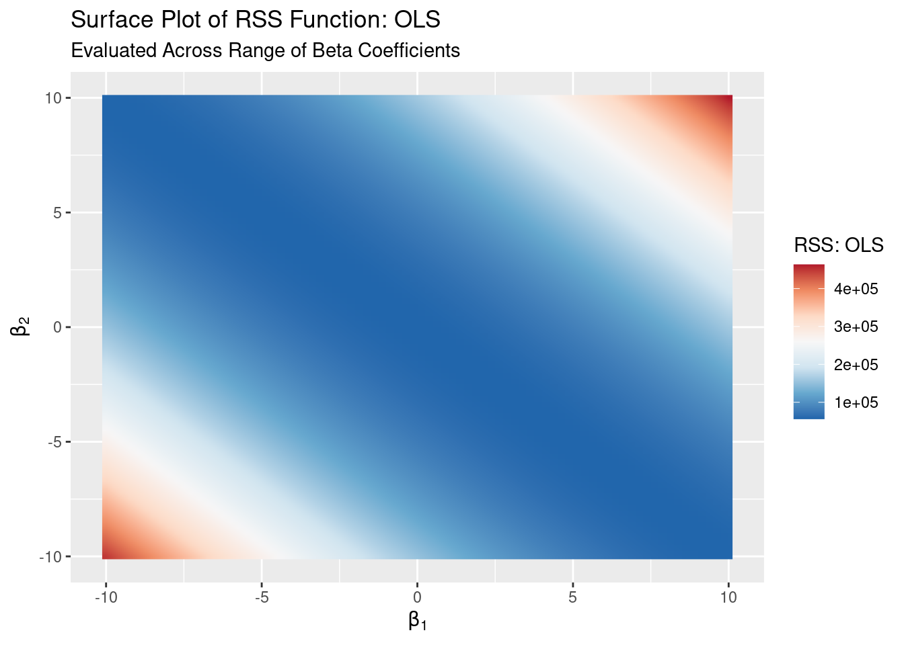
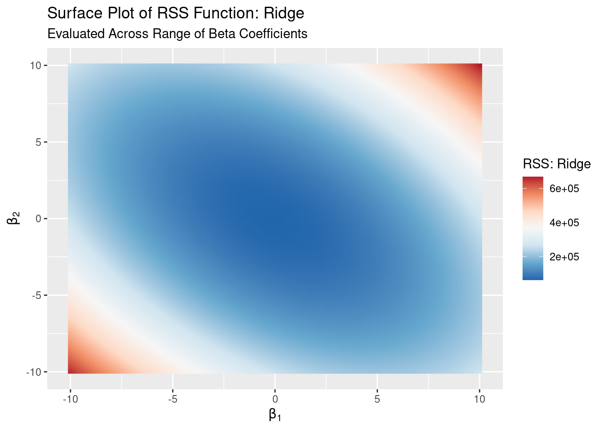
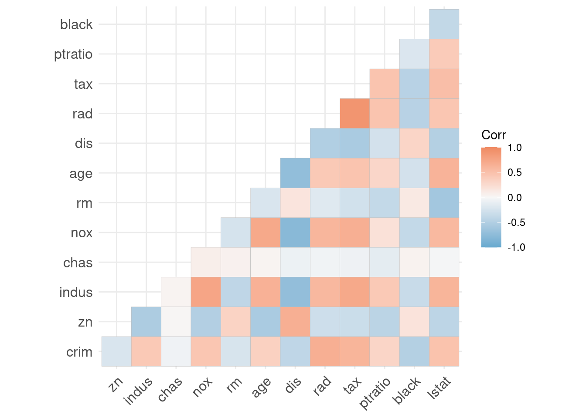
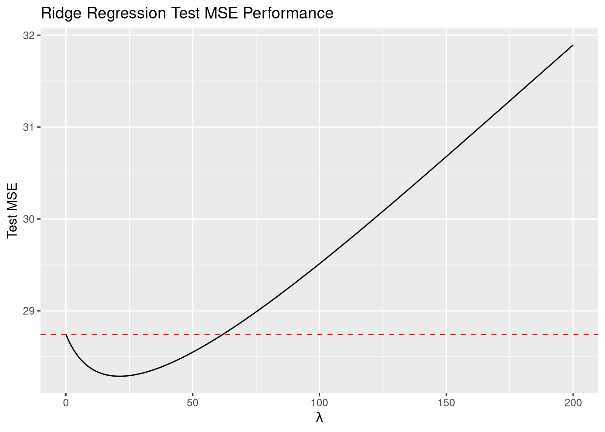

# Ridge Regression

This example walks through fitting a ridge regression model to idealized data. It assumes some prior knowledge of [ordinary least squares](https://en.wikipedia.org/wiki/Ordinary_least_squares){target="_blank"} and linear algebra.

Ridge regression is, functionally, nearly the same as OLS except that we include a constraint on the $\hat{\beta}$ vector in fitting the model. Constraining a model in this way is broadly called [regularization](https://en.wikipedia.org/wiki/Regularization_(mathematics)#Tikhonov-regularized_least_squares){target="_blank"} and makes the model less complex by either eliminating or penalizing low-contribution variables. In ridge regression, the particular form of regularization/constraint we use acts as a sum-of-squares (or a [L2](https://mathworld.wolfram.com/L2-Norm.html){target="_blank"}) penalty and shrinks rather than eliminates variables.

Ridge regression may be preferable to OLS if

1. there are a lot of independent variables/predictors to choose from and
2. some of those predictors are highly correlated with one another.

Ridge regression may have higher prediction accuracy than OLS due to OLS overfitting the training sample. It can be easily shown that OLS estimates, under [certain assumptions](https://en.wikipedia.org/wiki/Ordinary_least_squares#Assumptions){target="_blank"}, are [unbiased and have the lowest possible variance of unbiased estimators](https://en.wikipedia.org/wiki/Gauss%E2%80%93Markov_theorem){target="_blank"}. However, we can oftentimes get an even lower variance of the fitted values by allowing our estimates to be biased. This is usually not desirable if the goal of the model is inference, but we likely don't care as much if the goal is prediction. This can help improve model accuracy.

Ridge regression also performs a kind of variable selection by more severely penalizing estimates of variables that contribute less to the overall variance of the fitted values. So long as the penalty term in ridge regression is greater than zero it will shrink all regression coefficients toward zero but it will shrink those with larger projected sample variance less. Ridge regression cannot set coefficients to exactly zero, so it doesn't actually perform full variable selection.

## Theory

Just like in OLS, the intent is to minimize [residual sum of squares](https://en.wikipedia.org/wiki/Residual_sum_of_squares){target="_blank"}.

<center>
$$RSS = \sum_{i=1}^N (y_i - \hat{y}_i)^2$$
</center>

### Minimizing RSS: OLS

Before jumping into ridge regression, let's review deriving the OLS solution via minimizing RSS. Where $X$ is our [**design matrix**](https://en.wikipedia.org/wiki/Design_matrix){target="_blank"}:

<center>
$$\vec{\beta} = \{ \beta_0, \beta_1, \ldots, \beta_k \}$$

$$\begin{align*}
RSS(\vec{\beta})_{OLS} &= (\vec{y} - X \vec{\beta})^T(\vec{y} - X \vec{\beta}) \\
&= \vec{y}^T \vec{y} - \underbrace{\vec{y}^T X \vec{\beta}}_{\vec{\beta}^T X^T \vec{y}} - \vec{\beta}^T X^T \vec{y} + \vec{\beta}^T X^T X \vec{\beta} \\
&= \vec{y}^T \vec{y} - 2 \vec{\beta}^T X^T \vec{y} + \vec{\beta}^T X^T X \vec{\beta}
\end{align*}$$
</center>

Then minimizing^[Recall that $\frac{\partial a^T b a}{\partial a} = 2 a x$ and $\frac{\partial a^T b}{\partial a} = a$.] $RSS(\vec{\beta})$ with respect to $\vec{\beta}$

<center>
$$\begin{align*}
\frac{\partial RSS(\vec{\beta})_{OLS}}{\partial \vec{\beta}} = -2 X^T \vec{y} + 2 X^T X \vec{\beta} &= 0 \\
-2 (X^T \vec{y} - X^T X \vec{\beta}) &= 0 \\
X^T \vec{y} - X^T X \vec{\beta} &= 0 \\
X^T X \vec{\beta} &= X^T \vec{y} \\
\hat{\vec{\beta}}^{OLS} &= (X^T X)^{-1} X^T \vec{y}
\end{align*}$$
</center>

we get the [normal equation](https://mathworld.wolfram.com/NormalEquation.html){target="_blank"} along the way and arrive at the usual solution.

### Minimizing RSS: Ridge

The ridge minimization of RSS works the same way, except we include the penalty term ($\lambda$) on the squared values of our estimates. 

However, **the penalty does not apply to the intercept term**, so we will use a matrix of just our variables without a leading one-vector for the intercept term (which I will call the **input matrix**). It's easy to conceptualize how the ridge regression solutions for the non-intercept terms would depend on the intercept if we also penalized it. If the column vectors of $X$ are mean-centered then $\beta_0 = \bar{y}$. Then we minimize RSS with the penalty term as if there were no intercept.

<center>
$$\vec{\beta} = \{ \beta_1, \beta_2 \ldots, \beta_k \}$$

$$\begin{align*}
RSS(\vec{\beta})_{Ridge} &= (\vec{y} - X \vec{\beta})^T(\vec{y} - X \vec{\beta}) + \lambda \vec{\beta}^T \vec{\beta} \\
&= \vec{y}^T \vec{y} - \underbrace{\vec{y}^T X \vec{\beta}}_{\vec{\beta}^T X^T \vec{y}} - \vec{\beta}^T X^T \vec{y} + \vec{\beta}^T X^T X \vec{\beta} + \lambda \vec{\beta}^T \vec{\beta} \\
&= \vec{y}^T \vec{y} - 2 \vec{\beta}^T X^T \vec{y} + \vec{\beta}^T X^T X \vec{\beta} + \lambda \vec{\beta}^T \vec{\beta}
\end{align*}$$
</center>

Then minimize with respect to $\vec{\beta}$:

<center>
$$\begin{align*}
\frac{\partial RSS(\vec{\beta})_{Ridge}}{\partial \vec{\beta}} = -2 X^T \vec{y} + 2 X^T X \vec{\beta} + 2 \lambda \vec{\beta} &= 0 \\
-2 (X^T \vec{y} - X^T X \vec{\beta} - \lambda \vec{\beta}) &= 0 \\
X^T \vec{y} - X^T X \vec{\beta} - \lambda \vec{\beta} &= 0 \\
X^T \vec{y} &= X^T X \beta + \lambda \vec{\beta} \\
X^T \vec{y} &= \vec{\beta} (X^T X + \lambda I) \\
\hat{\vec{\beta}}^{Ridge} &= (X^T X + \lambda I)^{-1} X^T \vec{y}
\end{align*}$$
</center>

Notice that for $\lambda = 0$ our minimization is the same as with OLS, so a ridge regression fit with $\lambda = 0$ is just an OLS fit. In calculating MSE we will need to add $\beta_0 = \bar{y}$ in so long as we're concerned about being off by a constant.

### Important Features

This section is not strictly necessary and may be skipped, but know that

1. the ridge regression problem will never not have a solution because of [rank-deficiency](https://en.wikipedia.org/wiki/Rank_(linear_algebra)#Main_definitions){target="_blank"} or [linearly dependent](https://en.wikipedia.org/wiki/Linear_independence){target="_blank"} variables and
2. ridge regression performs a type of variable selection by shrinking variables that contribute less to the variance of fitted values more.[^bignote]

[^bignote]: It can be easy to think that this means the "less important" variables which don't "explain" our outcome are being shrunk more, but the reason why these variables are shrunk actually has nothing to do with the outcome. Remember that we're going for prediction here, not inference. So while it might not be true that the variables with higher variance "explain" our outcome, we don't really care since the goal isn't causally explaining the outcome.
  Elements of Statistical Learning explains this well:
  "The implicit assumption is that the response will tend to vary most in the directions of high variance of the inputs. This is often a reasonable assumption, since predictors are often chosen for study because they vary with the response variable, but need not hold in general."

#### Solvability

Because we add a positive constant, $\lambda I$, to the diagonal of $X^T X$ prior to inverting that matrix the resulting adjusted matrix will always be [nonsingular](https://en.wikipedia.org/wiki/Invertible_matrix){target="_blank"}. So there will always be a solution, even if $X^T X$ is [rank-deficient](https://en.wikipedia.org/wiki/Rank_(linear_algebra)#Main_definitions){target="_blank"}. This is not the case with OLS: ridge regression can provide solutions to least squares-like problems where OLS cannot.^[But, unlike OLS, the estimates will not be [BLUE](https://en.wikipedia.org/wiki/Gauss%E2%80%93Markov_theorem){target="_blank"}.] This may be useful if two or more variables are [linearly dependent](https://en.wikipedia.org/wiki/Linear_independence){target="_blank"} or are very highly correlated or if there are more variables than observations.

#### (Sort Of) Variable Selection

It's also important to note that **ridge regression shrinks all estimates toward zero, but it does not shrink them equally.**^[It would be pretty useless if it did shrink all variables equally!] Ridge regression shrinks the variables that contribute more variation to the fitted (or predicted) values less than those variables that don't: in this way, it performs a kind of variable selection.

To demonstrate this, we can take the [singular value decomposition](https://en.wikipedia.org/wiki/Singular_value_decomposition){target="_blank"} of the mean-centered input matrix.^[Remember, this is just our matrix of variable values, not including the one-vector that would be in the design matrix for the intercept.]

<center>
$$X = U D V^T $$
</center>

Like with all SVDs, the $D$ matrix is diagonal and contains the singular values (which are associated with [principal components](https://en.wikipedia.org/wiki/Principal_component_analysis){target="_blank"}) of $X$ along its diagonal in descending order.

We can take this decomposition of $X$ and plug it into our [hat matrix](https://en.wikipedia.org/wiki/Projection_matrix){target="_blank"} formula

<center>
$$\begin{align}
X \hat{\beta}^{Ridge} &= X (X^T X + \lambda I)^{-1} X^T \vec{y} \\
&= U D V^T (V D^T U^T U D V^T + \lambda I)^{-1} V D^T U^T \vec{y} \\
&= U D V^T (V D^T D V^T + \lambda I)^{-1} V D^T U^T \vec{y} && U^T U = I \\ 
&= UD (D^T D + \lambda I)^{-1}) D^T U^T \vec{y} && V^T V^{-1} (V^T)^{-1} V = I \\
&= UD (D^2 + \lambda I)^{-1} D U^T \vec{y} && D^T D = D^2 \text{, } D^T = D
\end{align}$$
</center>

where $U^T U = I$ because $U$ is symmetric, $V^T V^{-1} (V^T)^{-1} V = I$ because $V$ is [unitary](https://en.wikipedia.org/wiki/Unitary_matrix){target="_blank"}, and $D^T = D$ because $D$ is diagonal and therefore also symmetric.

If we focus on the above expression in terms of individual vectors of $U$ and individual diagonal elements of $D$ it's easy to see that

<center>
$$X \hat{\beta}^{Ridge} = \sum_{k = 1}^K \vec{u}_k \frac{\sigma_k^2}{\sigma_k^2 + \lambda} \vec{u}_k^T \vec{y}$$
</center>
where $K$ is the number of variables, $u_k$ is the $k$th column of $U$ (or the $k$th left [singular vector](https://en.wikipedia.org/wiki/Singular_value_decomposition#Singular_values,_singular_vectors,_and_their_relation_to_the_SVD){target="_blank"}), and $\sigma_k$ is the $k$th singular value. A hat matrix is simply a projection of $X$ onto the column space of $\vec{y}$, so it is clear to see here that the fraction is the penalty in that projection. It's also clear to see that, because the singular values are decreasing along the diagonal of $D$ (i.e., $\sigma_1 > \sigma_2, \ldots, > \sigma_K$), this penalty grows larger for basis vectors associated with smaller singular values: i.e., ridge regression more heavily shrinks the estimated "effect" of variables with smaller sample variance.

## Case 1: Linearly Dependent Variables

First we'll explore a simple case demonstrating how ridge regression can solve problems with [linearly dependent](https://en.wikipedia.org/wiki/Linear_independence){target="_blank"} variables when OLS can't. This is just a particular case of [rank-deficiency](https://en.wikipedia.org/wiki/Rank_(linear_algebra)#Main_definitions){target="_blank"}, the other one that can cause issues with OLS being having more variables (columns) than observations (rows) in your design matrix. Ridge regression can handle both cases.

### Data Generation

For the cases in this example, load the [`tidyverse`](https://cran.r-project.org/web/packages/tidyverse/index.html){target="_blank"},  [`MASS`](https://cran.r-project.org/web/packages/MASS/index.html){target="_blank"}, [`latex2exp`](https://cran.r-project.org/web/packages/latex2exp/index.html){target="_blank"},  [`ggcorrplot`](https://cran.r-project.org/web/packages/ggcorrplot/index.html){target="_blank"}, and [`RColorBrewer`](https://cran.r-project.org/web/packages/RColorBrewer/RColorBrewer.pdf){target="_blank"} packages.


```r
library(tidyverse)
library(MASS)
library(latex2exp)
library(ggcorrplot)
library(RColorBrewer)
```

We'll create one normally-distributed variable and then a second variable that is simply a multiple of the first to make the two variables linearly dependent.

Let's generate one variable with 1,000 observations, a mean between -10 and 10, and a standard deviation between 1 and 10.


```r
X1 <- rnorm(1000, mean = runif(1, -10, 10), sd = runif(1, 1, 10))
```

We'll make X1 linearly dependent with a new variable, X2, by making X2 a variable that is simply X1 divided by two.


```r
X2 <- X1 / 2
```

Next we'll write a [standardization](https://en.wikipedia.org/wiki/Standard_score){target="_blank"} function^[Why not use [`scale`](https://www.rdocumentation.org/packages/base/versions/3.6.2/topics/scale){target="_blank"}? Both `scale` and [`sd`](https://www.rdocumentation.org/packages/stats/versions/3.6.2/topics/sd){target="_blank"} use [Bessel's correction](https://en.wikipedia.org/wiki/Bessel%27s_correction){target="_blank"} to calculate the *sample* standard deviation. We instead use the [*population* standard deviation](https://glmnet.stanford.edu/articles/glmnet.html){target="_blank"}. [`glmnet`](https://cran.r-project.org/web/packages/glmnet/index.html){target="_blank"}, the primary ridge regression implementation in R, uses the population standard deviation when standardizing variables.] and standardize both of our variables.


```r
standardize <- function(vec){
  
  sd <- sqrt(sum((vec - mean(vec))^2) / length(vec))
  
  (vec - mean(vec)) / sd
  
}

X1_std <- standardize(X1)
X2_std <- standardize(X2)
```

Lastly we'll create a normally-distributed outcome variable.


```r
y <- rnorm(1000, mean = runif(1, -10, 10), sd = runif(1, 1, 10))
```

### The Problem: OLS

Let's run a simple linear regression and see what happens:


```r
summary(lm(y ~ X1_std + X2_std))
```

```
## 
## Call:
## lm(formula = y ~ X1_std + X2_std)
## 
## Residuals:
##     Min      1Q  Median      3Q     Max 
## -6.2579 -1.2354 -0.0098  1.1402  6.1318 
## 
## Coefficients: (1 not defined because of singularities)
##             Estimate Std. Error t value Pr(>|t|)    
## (Intercept) -0.33836    0.05455  -6.203 8.09e-10 ***
## X1_std       0.10551    0.05455   1.934   0.0533 .  
## X2_std            NA         NA      NA       NA    
## ---
## Signif. codes:  0 '***' 0.001 '**' 0.01 '*' 0.05 '.' 0.1 ' ' 1
## 
## Residual standard error: 1.725 on 998 degrees of freedom
## Multiple R-squared:  0.003735,	Adjusted R-squared:  0.002737 
## F-statistic: 3.742 on 1 and 998 DF,  p-value: 0.05334
```

As expected, R notes that our matrix is singular and returns `NA` for the X2 estimate. 

But why is this? The objective of OLS is to minimize RSS, but clearly that's not happening here. So let's start there: we can evaluate the RSS function from the theory section over combinations of $\beta_1$ and $\beta_2$ values to take a look at the RSS surface.^[This is almost identical to what we do in the [univariate binary logistic case](univariate_binary_logistic.html){target="_blank"} with the maximum likelihood function.].

Let's build our RSS function.


```r
RSS_OLS <- function(b_vec){
  
  t(y) %*% y - 2 * t(b_vec) %*% t(design_matrix) %*% y + t(b_vec) %*% t(design_matrix) %*% design_matrix %*% b_vec

}
```

Then we can create a dataset of $\beta_1$ and $\beta_2$ combinations and [`apply`](https://www.rdocumentation.org/packages/base/versions/3.6.2/topics/apply){target="_blank"} our function to it in order to evaluate the log likelihood functions for those $\beta$ values.


```r
b1_vec <- seq(-10, 10, .25)
b2_vec <- seq(-10, 10, .25)

surface <- bind_cols(mean(y), expand_grid(b1_vec, b2_vec))
design_matrix <- model.matrix(y ~ X1_std + X2_std)

surface$rss_ols <- apply(surface, MARGIN = 1, RSS_OLS)
```

So what does our log-likelihood surface look like in this case?


```r
rss_ols_surface_plot <- ggplot(surface, aes(x = b1_vec, y = b2_vec, fill = rss_ols)) +
  geom_raster(interpolate = TRUE) +
  # scale_fill_gradient(name = "RSS", high = 'red', low = 'blue') +
  scale_fill_distiller(palette = "RdBu", name = "RSS: OLS") +
  labs(title = "Surface Plot of RSS Function: OLS",
       subtitle = "Evaluated Across Range of Beta Coefficients",
       x = TeX("$\\beta_1$"),
       y = TeX("$\\beta_2$"))
```



There's a long **valley**! Clearly there's not a unique minimum here: there are many combinations of $\beta_1$ and $\beta_2$ that could minimize RSS, so there is no unique solution with OLS! The *valley* in the RSS function corresponds to a *ridge* in the maximum likelihood surface.

### A Solution: Ridge Regression

So how does ridge regression fix this optimization problem? By penalizing (or regularizing) our function!

Ideally we would choose our penalty term, $\lambda$, optimally by cross-validating but we'll arbitrarily set $\lambda = 1,000$ here to illustrate how ridge regression changes the RSS surface. Following the steps for evaluating the OLS RSS, we'll create our ridge RSS function.


```r
RSS_ridge <- function(b_vec){
  
  lambda <- 1000
  
  t(y) %*% y - 2 * t(b_vec) %*% t(input_matrix) %*% y + t(b_vec) %*% t(input_matrix) %*% input_matrix %*% b_vec + lambda * t(b_vec) %*% b_vec

}
```

As noted in the theory section, we do not penalize the intercept. So we will create an input matrix that only has our X1 and X2 variable values.


```r
input_matrix <- cbind(X1_std, X2_std)

surface$rss_ridge <- apply(surface[2:3], MARGIN = 1, RSS_ridge)
```

So what does our log-likelihood surface look like now?


```r
rss_ridge_surface_plot <- ggplot(surface, aes(x = b1_vec, y = b2_vec, fill = rss_ridge)) +
  geom_raster(interpolate = TRUE) +
  scale_fill_distiller(palette = "RdBu", name = "RSS: Ridge") +
  labs(title = "Surface Plot of RSS Function: Ridge",
       subtitle = "Evaluated Across Range of Beta Coefficients",
       x = TeX("$\\beta_1$"),
       y = TeX("$\\beta_2$"))
```



This looks much more like a surface with a unique minimum! Adding the [L2](https://mathworld.wolfram.com/L2-Norm.html){target="_blank"} penalty "lifts" up the ends of the long valley in the RSS surface to create a bowl, for which we can easily identify and solve for a unique minimum. This also makes it easy to see how this penalization pushes or shrinks our coefficients toward zero.

With OLS, we allow the least-squares solving process infinite space within which to find a unique solution, but this fails when we have a canyon in the RSS surface without a unique minimum. By applying the L2 constraint in the ridge regression definition of the problem we are restricting the solution space and forcing the solving process to find the best $\beta_1$ and $\beta_2$ that minimize RSS *within that space*. Residuals are a function of our $\beta$s, so this allows for residuals to be higher for some observations than they would be under OLS, which is evidenced by the "lifting" of the RSS surface above.

Choosing how much much space to allow (i.e., which value to use for $\lambda$) is another optimization problem that is context-dependent and usually addressed with cross-validation.

### Solving for $\hat{\beta}^{Ridge}$

We can easily implement the $\hat{\beta}^{Ridge}$ solution derived in the theory section. Let's write a function, `ridge`, to solve for the ridge regression coefficients and use it to solve our ridge regression problem.


```r
input_matrix <- cbind(X1_std, X2_std)
lambda <- 1000

ridge <- function(y_vec, X_matrix, lambda){
  
  # Arguments:
  # y_vec - a continuous outcome vector
  # X_matrix - a standardized input vector
  # lambda - a > 0 penalty term
  
  penalty <- lambda * diag(1, ncol(X_matrix))
  
  solve(t(X_matrix) %*% X_matrix + penalty) %*% t(X_matrix) %*% y_vec
  
}

b_vec_ridge <- ridge(y_vec = y, X_matrix = input_matrix, lambda = lambda)
```


```
##              [,1]
## X1_std 0.03517166
## X2_std 0.03517166
```

In this case, because our standardized variables are identical, our ridge regression coefficients are identical.

## Case 2: Correlated Independent Variables

Perfect [collinearity or multicollinearity](https://en.wikipedia.org/wiki/Multicollinearity#Definition){target="_blank"} like in the last case is rarely found in real data. What's much more common is having variables that are strongly correlated with one another, but not perfectly. When this is the case, OLS can

1. fail to find a solution due to numerical rounding (if variables are almost perfectly related) or
2. find an unstable solution that can vary wildly between similar data and make it difficult to discern which variables contribute most to prediction of the outcome (usually by imprecisely estimating coefficients).

In the same way as in the previous case, ridge regression can alleviate both of these problems, but to a different degree.

We won't perform cross validation to determine the optimal penalty parameter but will instead evaluate models over ranges of penalty values to show how ridge regression behaves over the range and compare to OLS.

### Data

For this case, we'll use the famous Boston housing data set. The data come pre-loaded in the [`MASS`](https://cran.r-project.org/web/packages/MASS/index.html){target="_blank"} package, so there's no need to download and read in data. The data set contains variables relating to home values in various towns and suburbs in Boston, such as `crim` (crime rate), `nox` (an air pollution measure), and `rm` (average number of rooms per home). We'll build a model to predict `medv`, the median value of a home in a town. Some of the variable names are not incredibly self-explanatory, so feel free to check the [documentation](https://www.rdocumentation.org/packages/MASS/versions/7.3-54/topics/Boston){target="_blank"} for more details.

This case uses many of the same packages and functions that were loaded and written in [the first case](case-1-linearly-dependent-variables.html), so review that case if not already completed.

We'll use `model.matrix` to create our input matrix without the vector for the intercept and separate `medv` into its own vector. 


```r
X <- model.matrix(medv ~ ., data = Boston)[,-1]
y <- Boston$medv
```

Then we can split our data into training sets and testing sets. We'll use [`sample`](https://www.rdocumentation.org/packages/base/versions/3.6.2/topics/sample){target="_blank"} to randomly pick 60% of the rows in the data to use as our training set while the other 40% will go into our testing set. Then we'll `apply` our `standardize` function we wrote to the input data for each set.


```r
train <- sample(1:nrow(X), nrow(X) * .6)
test <- (-train)

X_train <- apply(X[train,], 2, standardize)
y_train <- y[train]

X_test <- apply(X[test,], 2, standardize)
y_test <- y[test]
```

### Exploratory Analysis

We can easily visualize the correlations between the independent variables using the main function of the [`ggcorrplot`](https://cran.r-project.org/web/packages/ggcorrplot/ggcorrplot.pdf){target="_blank"} package. First we create a correlation matrix of the independent variables using [`cor`](https://www.rdocumentation.org/packages/stats/versions/3.6.2/topics/cor){target="_blank"},^[`cor` calculates Pearson's correlation by default.] R's built-in correlation function, and feed it into `ggcorrplot` for a quick and simple correlation heat map. 


```r
X_corr <- cor(X_train)

ggcorrplot(X_corr, type = "lower",
           colors = rev(brewer.pal(3, name = "RdBu")))
```



Several variables are highly correlated with one another. `indus` (a measure of town industrial concentration), `nox` (air pollution), and `age` (average home age) are all highly negatively correlated with `dis` (distance to employment centers). It's probably not a surprise that some towns in more industrial areas would have more exposure to air pollution and that development might be more common (and so home ages would be lower) in high-employment suburbs far away from job centers. But how much, together, are these variables contributing to prediction? In other words, do we need all of these variables that are highly related to one another or will one or two be enough to capture the "action" contained in all of them?

To explore this further, we can quickly perform a [principal component analysis](https://en.wikipedia.org/wiki/Principal_component_analysis){target="_blank"}^[If you're unfamiliar with PCA, see [this excellent intuitive explanation](https://stats.stackexchange.com/questions/2691/making-sense-of-principal-component-analysis-eigenvectors-eigenvalues/140579#140579){target="_blank"}.] of our input matrix. [`prcomp`](https://www.rdocumentation.org/packages/stats/versions/3.6.2/topics/prcomp){target="_blank"} is R's built-in PCA function. We'll look only at the first five principal components.


```r
boston_pcomps <- prcomp(X_train)$rotation[,1:5]
```

```
##                 PC1        PC2         PC3         PC4           PC5
## crim     0.24723382 -0.2511045  0.32667740 -0.05176398  0.0115208738
## zn      -0.25663683 -0.2949816  0.34809979  0.18933832 -0.2393946151
## indus    0.34672495  0.1184171 -0.05263250 -0.02367901 -0.0564490554
## chas    -0.01199561  0.5009851  0.25771830 -0.44547852 -0.6803669783
## nox      0.34539496  0.2109929  0.04747682  0.21510231  0.0005181504
## rm      -0.17494602  0.2982463  0.52407021 -0.11258859  0.5417159930
## age      0.31669117  0.3050543 -0.10973424  0.16707139  0.0979389787
## dis     -0.32017540 -0.3591163  0.04200562 -0.05483417 -0.2306089451
## rad      0.32352458 -0.2095725  0.30789728 -0.21403644  0.0560045383
## tax      0.33749996 -0.2005586  0.25100970 -0.14875406 -0.0015581921
## ptratio  0.20651028 -0.3128254 -0.25092106 -0.64907762  0.1514701909
## black   -0.20783511  0.1352615 -0.39138198 -0.32773507  0.1171877432
## lstat    0.30907152 -0.1706826 -0.19560668  0.27557840 -0.2835976550
```

The `rotation` matrix from `prcomp` contains the [loadings](https://en.wikipedia.org/wiki/Principal_component_analysis#Further_components), which are the correlations between the input variables and the directions represented by the principal components when the input variables are standardized.^[If this is unfamiliar, for now just think of this as a measure of how much a direction of a principal component is associated with the existing directions of the variables in the hyperplanar space occupied by the data.] To find how much each variable "contributes" to the direction of each principal component we simply take the column-wise absolute values as a percentage of the totals. We'll do this using a combination of [`sweep`](https://www.rdocumentation.org/packages/base/versions/3.6.2/topics/sweep){target="_blank"} to divide within columns and [`colSums`](https://www.rdocumentation.org/packages/base/versions/3.6.2/topics/colSums){target="_blank"} to get column totals.


```r
boston_pcomps <- as.data.frame(abs(boston_pcomps))
boston_pcomps <- sweep(abs(boston_pcomps), 2, colSums(abs(boston_pcomps)), "/") * 100
```

```
##                PC1       PC2       PC3        PC4         PC5
## crim     7.2625258  7.456042 10.520227  1.8004627  0.46674735
## zn       7.5387405  8.758884 11.210107  6.5855940  9.69863956
## indus   10.1850907  3.516158  1.694962  0.8236069  2.28693132
## chas     0.3523725 14.875744  8.299487 15.4947008 27.56383676
## nox     10.1460221  6.265009  1.528930  7.4817209  0.02099192
## rm       5.1390620  8.855824 16.877009  3.9160733 21.94664303
## age      9.3028444  9.057973  3.533850  5.8111022  3.96782047
## dis      9.4051942 10.663235  1.352737  1.9072503  9.34270404
## rad      9.5035767  6.222833  9.915437  7.4446478  2.26892251
## tax      9.9141054  5.955185  8.083445  5.1739861  0.06312733
## ptratio  6.0662663  9.288720  8.080591 22.5763152  6.13654065
## black    6.1051834  4.016318 12.603955 11.3993306  4.74764932
## lstat    9.0790161  5.068075  6.299262  9.5852092 11.48944572
```

Scanning across the principal components (columns) it's relatively easy to see which variables contribute the most to the first five principal components. This is analogous to the discussion in the theory section about variables being associated with singular values: we should expect that the variables that contribute the most to the these first few principal components will be among the slowest to shrink to zero as $\lambda$ increases.

### Implementation

We'll solve for our ridge regression estimates over a wide range of the penalty term, $\lambda$, to explore how ridge regression shrinks our variables - paying special attention to our three correlated variables - and how $\lambda$ plays a role in the [bias-variance tradeoff](https://en.wikipedia.org/wiki/Bias%E2%80%93variance_tradeoff#Bias%E2%80%93variance_decomposition_of_mean_squared_error){target="_blank"}. For this example we'll evaluate our models based on minimizing [mean square error](https://en.wikipedia.org/wiki/Mean_squared_error){target="_blank"}.

We'll create two outcome data sets, `betas` and `performance`, that show us how our estimated coefficients and how our mean square error behave across the range of $\lambda$s.


```r
betas <- NULL
performance <- NULL

for (lambda in seq(0, 1000, 1)) {
  
  b_vec <- ridge(y_train, X_train, lambda)
  b_MSE <- mean((X_test %*% b_vec + mean(y_test) - y_test)^2)
  
  betas <- bind_rows(betas, tibble("lambda" = lambda,
                                   "Variable" = colnames(X_train),
                                   "Coefficient" = b_vec))

  performance <- bind_rows(performance, tibble("lambda" = lambda,
                                       "Test_MSE" = b_MSE))
  
}
```

Let's visualize how the coefficients of our variables change as $\lambda \rightarrow \infty$. 


```r
palette <- colorRampPalette(brewer.pal(12, "Paired"))(length(colnames(X_train)))

coef_plot <- ggplot(betas, aes(x = lambda, y = Coefficient, color = Variable)) +
  geom_line(size = 1.5) +
  scale_color_manual(values = palette) +
  geom_hline(yintercept = 0,
             linetype = "dashed") +
  labs(title = "Ridge Regression Coefficient Shrinkage",
       x = TeX("$\\lambda$"))
```


As expected, the estimates for the variables with higher overall principal component contributions maintain their magnitude the most as $\lambda \rightarrow \infty$ while estimates for the variables that don't contribute much to the principal components (and therefore don't contribute much to the variance of the projected data) shrink more quickly toward zero.

Next, we'll visualize the test set MSE for $\lambda \rightarrow \infty$. Can ridge regression outperform OLS?


```r
performance_plot <- ggplot(performance %>% filter(lambda <= 200), 
                           aes(x = lambda, y = Test_MSE)) +
  geom_line() +
  geom_hline(yintercept = performance$Test_MSE[performance$lambda == 0], 
             linetype="dashed", 
             color = "red") +
  labs(title = "Ridge Regression Test MSE Performance",
       x = TeX("$\\lambda$"),
       y = "Test MSE")
```



The dashed red line represents the test MSE for OLS (i.e., where $\lambda = 0$). With some penalty, ridge performs better in prediction than OLS in this case with this train/test split. 

Shrinking some of our coefficients close to zero (i.e., using a penalty, like $\lambda$ in ridge regression) can minimize the variance of our fitted/predicted values, which can sometimes translate to better predictions. While estimating model variance via bootstrapping is outside the scope of this example, generally OLS - which minimizes bias but at the expense of allowing more than the minimum variance - doesn't reach as low a MSE as a regularized regression like ridge regression - which can find a balance between bias and variance that minimizes MSE. However, this can change depending on the particular data in the train/test split.

## Standardization

Why did we standardize our independent variables in these cases? Because the ridge regression solutions will change depending on the scales of the variables. In reality, this may be because of differences in units between variables (e.g., a dataset with temperatures, distances, monetary values measured in whole amounts or 1000s, etc.). Standardizing puts our variables on the same scale.

OLS does not have this problem: it will find the same solution for the same data, scaled or not. To illustrate the point, let's generate samples of two independently normally distributed variables as well as versions of those variables scaled or multiplied by 1000. 


```r
y <- rnorm(1000, mean = 0, sd = 1)

X1 <- rnorm(1000, mean = runif(1, -10, 10), sd = runif(1, 1, 5))
X2 <- rnorm(1000, mean = runif(1, -10, 10), sd = runif(1, 5, 10))

X1_scaled <- X1 * 1000
X2_scaled <- X2 * 1000
```

Fitting a simple linear model, we can easily see that the model produces a scaled version of the non-scaled fit using the scaled data.


```r
lm(y ~ X1 + X2)$coefficients
```

```
##  (Intercept)           X1           X2 
## -0.043579690  0.003784569 -0.006813352
```

```r
lm(y ~ X1_scaled + X2_scaled)$coefficients
```

```
##   (Intercept)     X1_scaled     X2_scaled 
## -4.357969e-02  3.784569e-06 -6.813352e-06
```

But we won't get identical solutions if we fit both versions of the data using ridge regression for any $\lambda > 0$. The estimated effects of the independent variables on the outcome fundamentally change, not simply by the magnitude of the change in scale.


```r
ridge(y = y, X = cbind(X1, X2), lambda = 1)
```

```
##            [,1]
## X1 -0.002406805
## X2 -0.007975358
```

```r
ridge(y = y, X = cbind(X1_scaled, X2_scaled), lambda = 1)
```

```
##                    [,1]
## X1_scaled -2.406919e-06
## X2_scaled -7.975494e-06
```

In other words, OLS solutions are *equivariant* to scaling but ridge solutions aren't. Standardizing the data removes scaling for comparability.

Of course, we lose some interpretability in the need to standardize our data and it means that we must input standardized test data into our ridge model for prediction (rather than raw data).  [`glmnet`](https://cran.r-project.org/web/packages/glmnet/index.html){target="_blank"}, the most prominent implementation of ridge regression in R, implements ridge regression in a different way than presented here: it standardizes the data within the function (so that data don't need to be standardized prior to the call) and then produces de-standardized regression coefficients that can be used with raw, non-standardized test data for prediction. See the [`glmnet` vignette](https://glmnet.stanford.edu/articles/glmnet.html){target="_blank"} for details. [`tidymodels` and `parsnip`](https://parsnip.tidymodels.org/reference/details_linear_reg_glmnet.html){target="_blank"} use `glmnet` to implement regularized regression.
