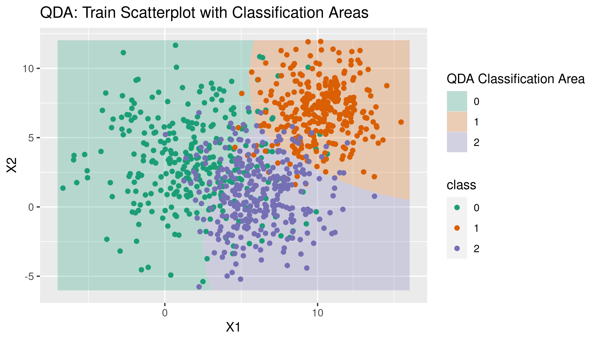

# {-}

<center>
</img>
</center>

```{r common_packages, include=FALSE}
knitr::opts_chunk$set(echo = TRUE)
library(tidyverse)
library(patchwork)
library(xaringanExtra) # If needed: devtools::install_github("gadenbuie/xaringanExtra")
```